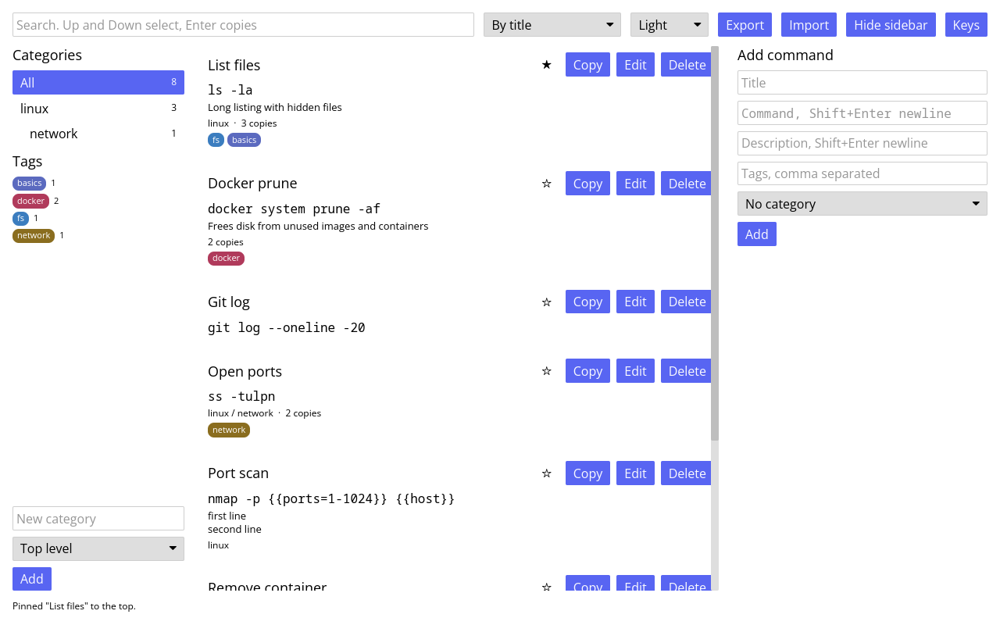

# CommandVault

Desktop app for storing and finding the shell commands you reuse. Type a few
words to filter the list, press Enter, and the command is on the clipboard.
Written in Rust with the iced GUI toolkit. The vault is one JSON file and
there is no daemon.



Version 0.5.0. MIT licence.

## Install

Needs Rust 1.88 or newer and a Wayland or X11 session.

```bash
git clone https://github.com/tidynest/CommandVault.git
cd CommandVault
cargo install --path .
```

That puts `command_vault` in `~/.cargo/bin`. To try it without installing, run
`cargo run` in the clone instead. For a launcher entry, copy the two files
under `assets/`:

```bash
install -Dm644 assets/commandvault.desktop ~/.local/share/applications/commandvault.desktop
```

```bash
install -Dm644 assets/commandvault.svg ~/.local/share/icons/hicolor/scalable/apps/commandvault.svg
```

The entry runs `command_vault` from `PATH`, so a launcher that does not read `~/.cargo/bin` needs the full path in `Exec`.

## Usage

Start `command_vault`. The search box has focus, so typing filters the list at
once. The form on the right adds a command, and only the command field is
required.

- Store a command with a title, description and tags. Only the command is required, an empty title becomes its first line. The command and description fields take several lines, so a short script and its notes fit. Tags show as coloured chips, click one to search for it. The sidebar lists every tag in use with a count, and those chips take the same clicks.
- Nested categories, each with its command count. Click one to see its subtree, add, rename, move and delete from the sidebar.
- Search as you type. Every word must appear somewhere in the title, description, command, tags or category path, so `docker rm` finds a docker command with rm in its text, and `"docker rm"` in quotes has to appear as written. `tag:docker` matches only commands tagged docker, `cat:linux` only those under a category named linux, and a chip click searches with the tag prefix. Up and Down pick a row, Enter copies it to the clipboard. Each row shows its category path.
- Saving a command whose text already exists still saves it, and the status line names the existing one.
- Edit and delete in place. Every change is written to disk at once. A row shows how many times it has been copied. The star on a row pins the command to the top under every order.
- Placeholders: write `{{host}}` in a command and Copy first asks for a value per name, in a row where the status line sits. `{{port=22}}` prefills 22, and a value typed once is offered again for that name until the app closes. Enter copies the filled command, As is copies the template, the stored one keeps its markers.
- Import pulls the 50 most used commands from your shell history, those used twice or more, tagged `history`, into the selected category. Reads `$HISTFILE`, else the zsh, bash or fish history file. Commands already in the vault are skipped, so it is safe to repeat, and Undo removes the whole batch.
- Export the visible commands as Markdown, grouped by category, to `export.md` beside the vault and to the clipboard, and as a shell script to `export.sh`, each command under a comment with its title, description, category and tags. `export.csv` is a spreadsheet with one row per command, and a cell that starts with `=`, `+`, `-` or `@` gets a leading `'` so a spreadsheet shows it as text instead of running it. `export.json` is a vault file holding just those commands with their categories and tag colours, so it can be opened as a vault of its own. Filter first to export one category.
- A copy is wiped from the clipboard 30 seconds later if it is still there, since commands carry tokens. A later copy of something else is left alone. `clear_after` in the settings changes the delay, 0 keeps the copy.

## Files and settings

Data lives at `$XDG_CONFIG_HOME/commandvault/vault.json`, falling back to `~/.config/commandvault/vault.json`. Saves go through a synced temp file and a rename, so a crash mid-write keeps the previous vault. The version before each save is kept as `vault.json.bak`. If another program wrote the file since the app read it, that version is kept as `vault.json.<seconds>.bak` before the save and the status line says so. The newest ten of those copies stay, older ones are removed when a new one is made. Tag colours are picked from a fixed palette the first time a tag appears and stored under `tags` in the vault. Right-click a chip to cycle through the palette, or edit the hex in the file for any other colour. File and directory are created readable by you only, since commands can contain tokens. A vault that fails to parse disables saving for the session instead of being overwritten.

Settings live in `config.json` next to the vault. The window size is written there when the window closes and used again next start. `sort` is the list order: `title`, `recent` for last updated first, `popular` for most copied first, or `copied` for last copied first. `scheme` is `system` or the lowercase name of one of iced's built-in themes, `dark`, `dracula`, `nord`, `tokyo night storm` and so on, the drop-down beside the sort lists them all. Both have a drop-down beside the search box. `zoom` is the scale factor set with Ctrl+Up and Ctrl+Down. `category` is the sidebar selection, restored on the next start. `sidebar` is whether the category and tag column is shown, toggled with Ctrl+B or the button beside Import. `clear_after` is the number of seconds until a copied command or export is wiped from the clipboard, 30 by default, 0 never. `compact` hides descriptions, paths and chips in the list, Ctrl+Shift+B. `COMMANDVAULT_SORT=recent` sets the startup order without touching the file, and `system` follows the desktop's light or dark preference while the app runs.

`RUST_LOG=debug cargo run` prints load and save events. `command_vault --version` prints the version, `--help` a usage line with the data directory, and any other argument the same on stderr with exit code 2.

## Keyboard and mouse

| Key | Action |
|---|---|
| Typing | Filters the list. The search box has focus on start. |
| Up, Down | Move the highlighted row. |
| PageUp, PageDown | Move it ten rows. |
| Home, End | First or last row, once the search box has lost focus. |
| Alt+Up, Alt+Down | Previous or next category in the sidebar, All included. |
| Enter | Copy the highlighted row, or the first match, which becomes highlighted. In a form, submit it. Shift+Enter in the command or description field adds a line. |
| Tab, Shift+Tab | Next or previous text field. From the search box the order is category box, title, command, description, tags. |
| Escape | Close the key panel, leave the current text field, or close an open fill or rename row. Pressed again, clear the search and highlight and cancel any edit. |
| Ctrl+Z | Undo the last delete, edit, import, tag rename or removal, or category change, up to twenty steps back. A tag merge has no undo. An Undo button appears in the status line too. |
| Ctrl+Up, Ctrl+Down | Zoom the whole window in steps of 10%, between 50% and 200%. Saved. |
| Ctrl+B | Hide or show the sidebar, the list takes its width. Saved. |
| Ctrl+Shift+B | Compact rows, title and command only, or full rows. Saved. |
| Ctrl+F | Jump to the search box, keeping the search, highlight and form as they are. |
| Ctrl+R | Reload the vault from disk now. A file another program wrote is picked up on its own within a few seconds. |
| F2 | Rename or move the selected category, with the cursor in its name. |
| F1 | Show this table inside the app. The Keys button does the same, Escape or a click outside closes it. |
| Ctrl+N | Start a new command with the title field focused. |
| Ctrl+E | Edit the highlighted row. |
| Ctrl+Shift+E | Copy the highlighted row's fields into the form as a new command. |
| Ctrl+D | Delete the highlighted row. Delete does the same once the search box has lost focus. |
| Ctrl+P | Pin or unpin the highlighted row. |
| Click a row | Highlight it. Double-click copies it. |
| Click a category | Filter by it. Double-click renames or moves it, like F2. |
| Click a tag chip | Search for that tag. |
| Right-click a tag chip | Give the tag the next palette colour. |
| Double-click a tag chip | Rename the tag on every command, or remove it from all of them with the Remove button. Renaming onto an existing tag merges them. |

## Tests and checks

```bash
cargo test
```

Most tests drive the app through its message loop without opening a window,
the rest are unit tests inside the modules, and `tests/cli.rs` runs the built
binary with `--version`, `--help` and a bad flag.

The benchmarks in `src/app/tests/bench.rs` time search, every sort order, save
and load, export and the category tree over a vault of ten thousand commands.
They are ignored by default. Run them in release and read the medians:

```bash
cargo test --release bench -- --ignored --nocapture --test-threads=1
```

Search takes a few milliseconds there, saving and loading about ten each.

```bash
cargo clippy --all-targets -- -D warnings
cargo fmt --check
cargo deny check
```

`.github/workflows/ci.yml` runs fmt, clippy, the tests and a release build on
every push to `main` and on pull requests, with cargo-deny in a second job
that also covers advisories. `.gitlab-ci.yml` runs the same first four.
`deny.toml` lists the allowed dependency licences and the two "unmaintained"
advisories that arrive through iced. `CHANGELOG.md` lists what each version
brought. Requirements and the file layout are in `docs/`, design diagrams in
`images/`.

## Licence

MIT, see `LICENSE`.
